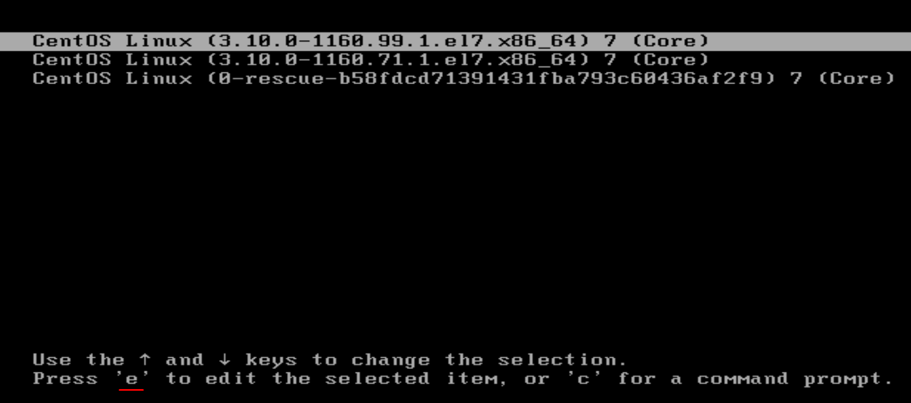
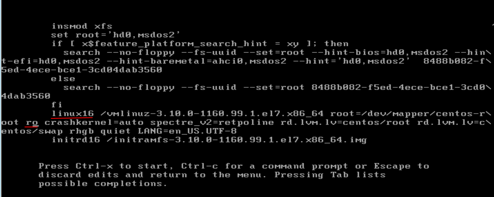
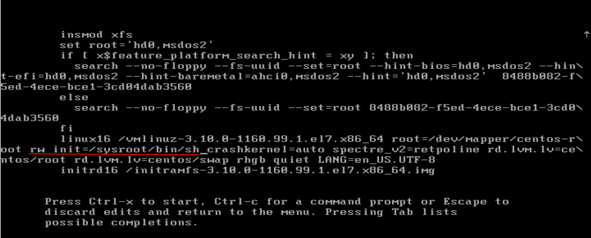
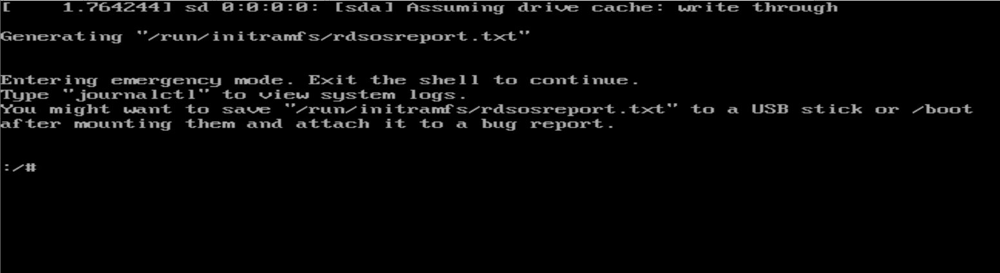
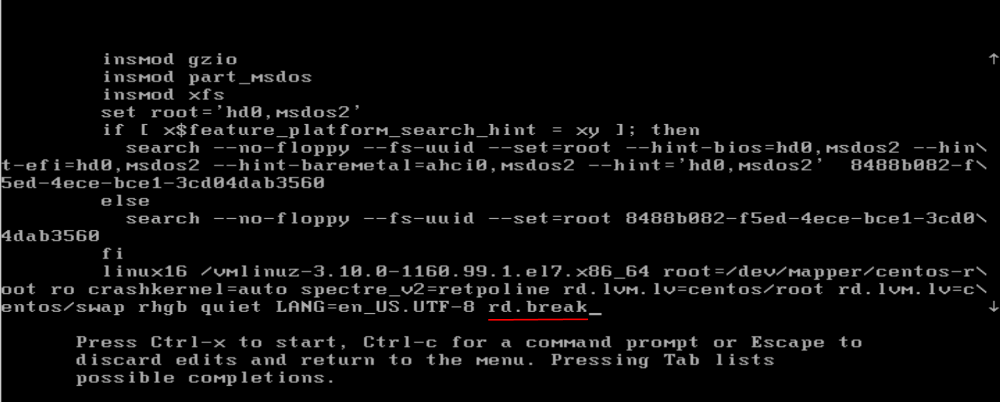
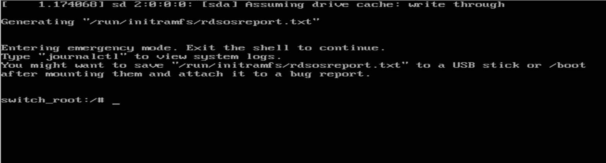

## Resetting Root Password on CentOS 7:

Let me show you how to reset the root password in CentOS 7.


### Method-1:

#### Step-1: Reboot the system:

When the **GRUB boot menu** appears, quickly **press** `e` to edit the default boot entry.




#### Step-2: Edit GRUB boot options:

Find the line starting with `linux16` or `linuxefi` and change `ro` to `rw` with add  `init=/sysroot/bin/sh`: 






#### Step-3: 

Now press, `Control+x` to boot or start on single user mode or rescue mode:





_Now, inside shell type this command:_
```
chroot /sysroot
```


#### Step-4: Reset the root password:

_Set a new root password:_
```
passwd root
```


#### Step-5: Update selinux information:

```
touch /.autorelabel
```


#### Step-6: Exit Chroot:

```
exit
```


#### Step-7: Reboot your system:

```
reboot
```


Now you can login as root with your updated password.


---
---


### Method-2:

#### Step-1: Reboot the system:

When the **GRUB boot menu** appears, quickly **press** `e` to edit the default boot entry.


#### Step-2: Edit GRUB boot options:

Find the line starting with `linux16` or `linuxefi` and move to the cursor start  of line with `linux16` and Press the **End** button to move the cursor to the **end of the line**. At the end of that line, Type: `rd.break`





#### Step-3: Boot into emergency mode:

Press `Ctrl+x` to boot with the modified parameters.




#### Step-4: Remount root filesystem as writable

```
mount -o remount,rw /sysroot/
```

_Then `chroot` into it:_
```
chroot /sysroot
```


#### Step-5: Reset root password:

_Set a new root password:_
```
passwd root
```


#### Step-6: Relabel SELinux:

```
touch /.autorelabel
```


#### Step-7: 
Finally, type `exit` twice;

```
exit
exit
```


#### Step-8: Reboot your system:

```
reboot
```


Now you can login as root with your updated password.