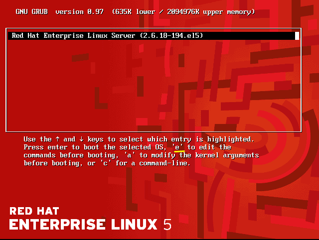

## Resetting Root Password on Redhat Linux 5:


### Step-1: Restart Linux Machine:

When system booting Press **any key or Esc** interrupt the automatic boot process and the **GRUB boot menu** appears, quickly **press** `e` to edit the default boot entry.





Then, select your kernel like `kernel /vmlinuz-2.6.18-194.el5 ro root=LABEL=/ rhgb quiet` and again **press** `e` edit the boot option:


### Step-2: Edit GRUB boot option:

Find the line starting with **grub edit>** and Press the **End** button to move the cursor to the **end of the line**. Type: `single` to boot into single-user mode and then  **press** `Enter`:


### Step-3: Boot the system:

Now, **press** `b` to boot the system: 


### Step-4: Reset root password:

_Set a new root password:_
```
passwd root
```


### Step-5: Reboot your system:

_Now, restart the machine:_

```
logout
```

Or,

```
init 6
```


### Ref: 
- [RedHat Linux-5 root password reset | Video](https://www.youtube.com/watch?v=UyrzW1Mv46g)


