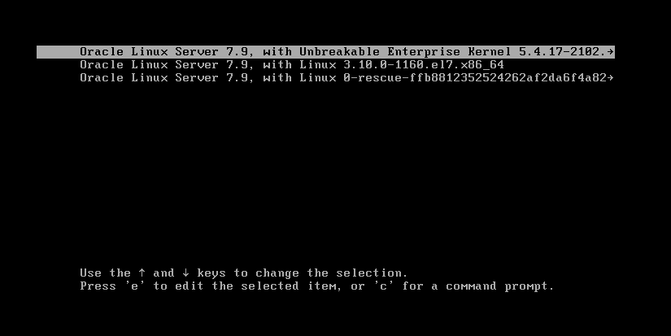
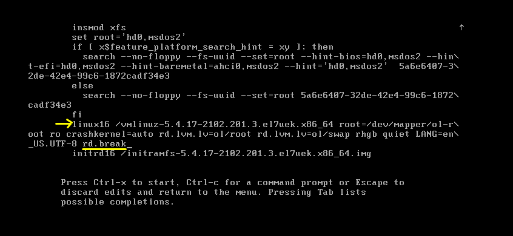
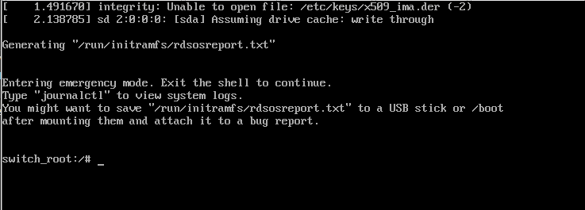

## Resetting Root Password on Oracle Linux 7:


#### Step-1: Reboot the machine:

When the **GRUB boot menu** appears, select the kernel (like: `Oracle Linux server 7.9, with Unbreakable Enterprise kernel 5.4.17-2102.`) your want to boot and quickly **press** `e` to edit the default boot entry.





#### Step-2: Edit GRUB boot options:

Find the line that refers to the kernel: 
- For **RHEL/CentOS 7**, the line starts with `linux16`.
- For **RHEL/Centos 8x**, and Fedora the line starts with `linux`.


Find the line starting with `linux16` or `linuxefi` and move to the cursor start  of line with `linux16` and Press the **End** button to move the cursor to the **end of the line**. At the end of that line, Type: `rd.break`





#### Step-3: Boot into emergency mode:

Press `Ctrl+x` to boot with the modified parameters.





#### Step-4: Remount root filesystem as writable

```
mount -o remount,rw /sysroot/
```

_Then `chroot` into it:_
```
chroot /sysroot
```


#### Step-5: Reset root password:

_Set a new root password:_
```
passwd root
```


#### Step-6: Relabel SELinux:

```
touch /.autorelabel
```


#### Step-7: 
Finally, type `exit` twice;

```
exit
exit
```


#### Step-8: Reboot your system:

```
reboot
```


Now you can login as root with your updated password.


